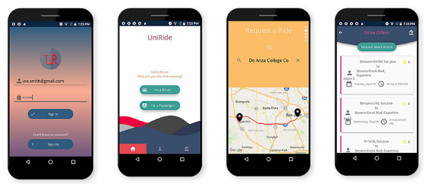
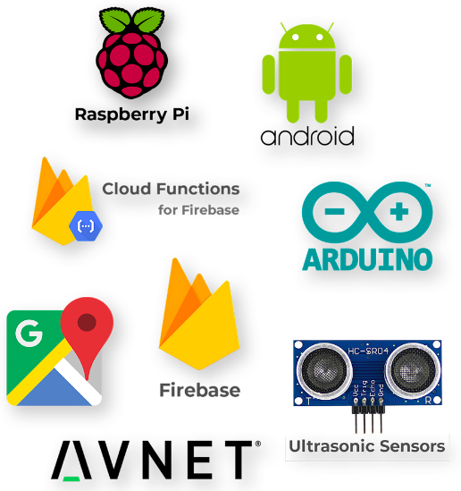
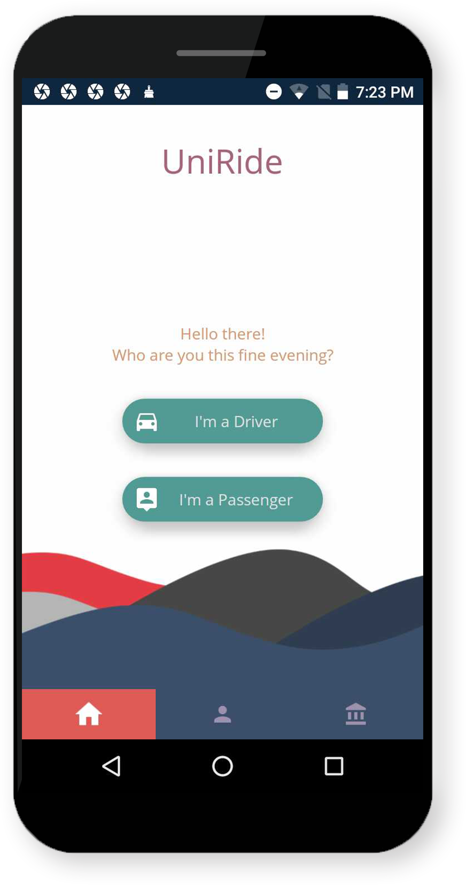
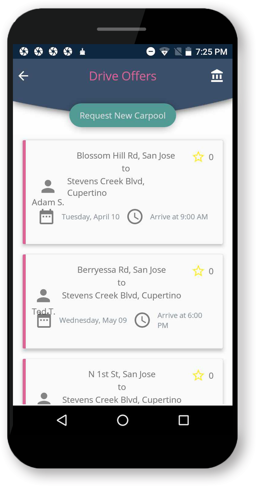
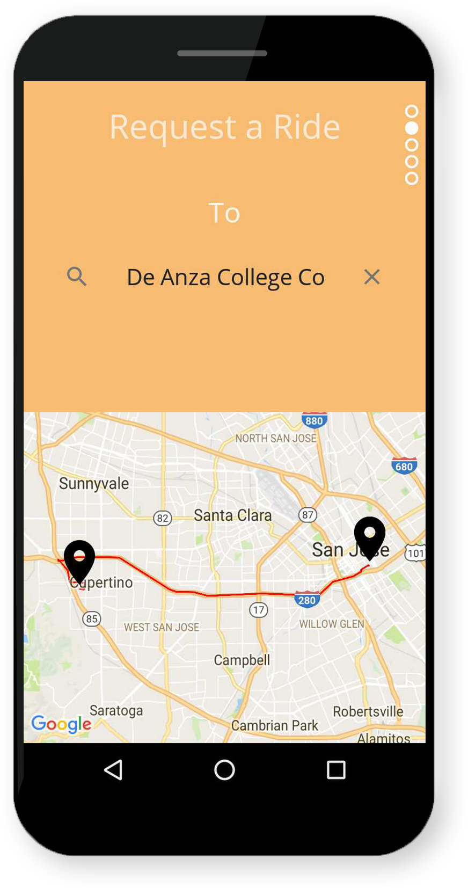
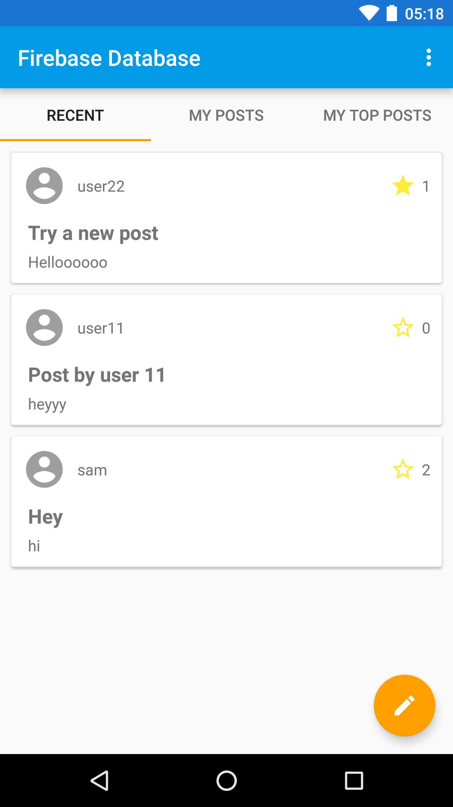

UniRide - Carpool and Parking System README
=============================

Project GitHub Link:
https://github.com/195-uniride/UniRideAndroid

Demo Video Google Drive Link:
https://drive.google.com/drive/folders/1TqlXTmnG-2Ag81O6vyZhRMbf-LRTJhEq?usp=sharing

Project Report:
https://drive.google.com/open?id=11OCSYPyF5YM3E-ee-xoqXjSHFxVUQn0e

UniRide - Carpool and Parking System
---------------

UniRide consists of an Android mobile application and a parking system that utilizes IoT technology. The Android application allows users to carpool together based on their scheduled trips, organization, source location and destination. UniRide uses a matchmaking algorithm that filters the posts seen by the current user. Users are able to choose and join a carpool that best suits their liking. When a user joins a carpool, members of the existing carpool will be notified with a notification sent to their phone. During the day of the scheduled carpool, each member of the carpool will again be notified to remind users of the carpool that will take place that day. UniRide uses Google Maps to navigate drivers to their destinations. When they arrive at their destination, UniRide’s parking system will assist the carpoolers to a designated parking space within the parking lot. The parking system utilizes ultrasonic sensors to monitor the status of a parking space. Ultrasonic sensors can identify if a parking space is available or occupied, and this data will be visible through the UniRide Android mobile application. The captured data from the sensors are sent to the mobile application through programs written within the Raspberry Pi and Arduino. 

This document only has details to install and deploy the Android mobile application and does not specify how to setup the parking sensor system. 


Current Application Screenshots

Getting Started
---------------

- Download the latest Android Studio.

https://developer.android.com/studio/

- Connect an Android mobile phone to your system if you want to deploy the app on your device, otherwise use the emulator on Android Studio.

https://developer.android.com/studio/run/emulator

- Clone or download the project from the GitHub repository.

https://github.com/195-uniride/UniRideAndroid

- Use Android Studio to open the project.

Navigate to the app folder in the root of the UniRide project folder.
Choose app folder to open project in Android Studio

Result
-----------
	
Once the application is running, the Sign In page should be displayed.


Troubleshooting
-----------

If the app does not run at first, run Gradle Sync.

Tools → Android → Sync Project with Gradle Files

If there is an issue with Gradle not being installed, see:

https://gradle.org/install/

If Android Studio says that google-services.json file is missing, it may need to be added to the app folder. Download the google-services.json file in the Google Drive Project Demo folder:
https://drive.google.com/drive/folders/1TqlXTmnG-2Ag81O6vyZhRMbf-LRTJhEq?usp=sharing

Technology Used
---------------



- **Android** mobile operating system for application software.
- **Firebase Realtime Database** for storing data and **Cloud Functions** for sending notifications to users.
- **Ultrasonic Sensor** for monitoring parking spaces.
- **Avnet Cellular Shield** for internet connection
- **Arduino** and **Raspberry Pi** for analyzing and sending sensor data.

Data Model
---------------

Firebase Dashboard:
https://console.firebase.google.com/u/0/project/uniride-c45e0/overview

Firebase database has eight nodes:

- **Users**: a list of User objects
Structure: /users /[userID] / [userInfo]

- **User-Posts**: a list of posts by user
Structure: /[userID] / [postType] /[postID] /[postInfo]

- **User-Organizations**: a list of organizations by user
Structure: /[userID] /[organizationID] /[organizationInfo]

- **Posts**: a list of Post objects
Structure: /[postType = driverOffers or rideRequests] /[postID] /[postInfo]

- **Parking-Garage**: holds information about monitored parking spaces
Organizations: a list of Organization objects
Structure: /[organizationID] /[organizationInfo]

- **Organization-Posts**: a list of organizations by post
Structure: /[organizationID] /[postType] /[postID] /[postInfo]

- **Messages**: a list of Message objects

Application Structure
---------------
The code classes are located in the *app/java/com.sjsu.se195.uniride* folder.


There are a number of classes used. Every class belongs to one of the following categories:

- **Activity classes**

Classes used to display the UI of a screen within the application. This includes the home page, the post feed pages, the user profile page, and all other main screens. Activity classes may use Fragment classes to display small portions of the screens view.

- **Fragment classes**

Classes used to display part of a UI section to be contained within an Activity class, including lists and views for individual tabs.

- **Model classes**

Classes used to store the structure of the main model components of the application, including user, post, organization, and carpool objects. These model classes are linked to Firebase and represent data to be persisted. A number of model classes implement the Parcelable class, which Android uses to send objects quickly between Activities and Fragments.

- **View Holder classes**

Classes used to describe aspects of list views, including how each item in a list should appear.

- **Helper classes**

Various other classes used to perform some function to assist other classes. These include custom classes such as the PostSearcher class and the Mapper class.

Descriptions of main classes:
-----------

- *MainActivity*

Displays the home page of the application. From the home page, the user can select to view Drive Offer posts or Ride Request posts. Selecting either of these options redirects the user to the MainSubcategoryActivity page.



- *MainSubcategoryActivity*

Displays the post feed list for the type of post selected (Drive Offer or Ride Request). Shows only posts from the currently selected organization (The user must have joined at least one organization to see any posts). The post feed within the page is displayed by using the PostListFragment class.



- *PostListFragment*

The feed is populated by posts stored in the Firebase node for this organization. Each post within the list is defined by the PostViewHolder class. Selecting a post from the list redirects the user to the PostDetailPage.

- *PostDetailActivity*

Displays the details of the post selected, including the trip arrival and departure times and locations, the trip date, and the poster’s user name. The user can select to Join the post (if the post is not their own) or Search for Matches (if the user did create this post). Selecting Join redirects the user to the NewCarpoolActivity page and selecting Find Matches redirects the user to the SearchResultsActivity page.

- *NewPostActivity*

Displays the pages that are used to create a new post. The Activity displays a carousel of pages that ask the user to input the starting address, the destination address, the arrival and departure times, and the number of passengers the user is willing to pick up (if it is a Drive Offer post).



- *Mapper*

A helper class that performs the API call to Google Maps Directions API and determines the carpool trip time, duration, and the optimized order to pickup the passengers of the trip. 


Firebase Database Quickstart
=============================

Introduction
------------

- [Read more about Firebase Database](https://firebase.google.com/docs/database)

Getting Started
---------------

- [Add Firebase to your Android Project](https://firebase.google.com/docs/android/setup).
- Log in to the [Firebase Console](https://console.firebase.google.com).
- Go to **Auth** tab and enable **Email/Password** authentication.
- Run the sample on Android device or emulator.

Result
-----------



Data Model
-----------
This quickstart demonstrates a simple data model for a social application.
While this data model uses some of the Firebase best practices, it has some
known tradeoffs made for simplicity that would not scale to very large numbers
of users.

The database has four "root" nodes:

  * `users` - a list of `User` objects, keyed by user ID. So
    `/users/<ID>/email` is the email address of the user with id=`<ID>`.
  * `posts` - a list of `Post` objects, keyed by randomly generated push ID.
    Each `Post` contains the `uid` and `author` properties to determine the
    identity of the author without a JOIN-style query.
    * Posts contain a `stars` property which is a `Map` of user IDs to boolean
      values.  If `/posts/<POST-ID>/stars/<USER-ID>` is `true`, this means
      the user with ID `<USER-ID>` has starred the post with ID `<POST-ID>`.
      This data nesting makes it easy to tell if a specific user has already
      starred a specific post, but would not scale to large numbers of stars
      per post as it would make loading the Post data more expensive.
  * `user-posts` - a list of posts by the user.  `/user-posts/<USER-ID>` is a list
     of all posts made by a specific user, keyed by the same push ID used in
     the `posts` tree. This makes it easy to query "all posts by a specific
     user" without filtering through all Post objects.
  * `post-comments` - comments on a particular posts, where
    `/post-comments/<POST-ID>` is a list of all comments on post with id
    `<POST-ID>`.  Each comment has a randomly generated push key. By keeping
    this data in its own tree rather than nesting it under `posts`, we make it
    possible to load a post without loading all comments while still
    having a known path to access all comments for a particular post.

Database Rules
---------------
Below are some samples rules that limit access and validate data:

```javascript

{
  "rules": {
    // User profiles are only readable/writable by the user who owns it
    "users": {
      "$UID": {
        ".read": "auth.uid == $UID",
        ".write": "auth.uid == $UID"
      }
    },

    // Posts can be read by anyone but only written by logged-in users.
    "posts": {
      ".read": true,
      ".write": "auth.uid != null",

      "$POSTID": {
        // UID must match logged in user and is fixed once set
        "uid": {
          ".validate": "(data.exists() && data.val() == newData.val()) || newData.val() == auth.uid"
        },

        // User can only update own stars
        "stars": {
          "$UID": {
              ".validate": "auth.uid == $UID"
          }
        }
      }
    },

    // User posts can be read by anyone but only written by the user that owns it,
    // and with a matching UID
    "user-posts": {
      ".read": true,

      "$UID": {
        "$POSTID": {
          ".write": "auth.uid == $UID",
        	".validate": "data.exists() || newData.child('uid').val() == auth.uid"
        }
      }
    },


    // Comments can be read by anyone but only written by a logged in user
    "post-comments": {
      ".read": true,
      ".write": "auth.uid != null",

      "$POSTID": {
        "$COMMENTID": {
          // UID must match logged in user and is fixed once set
          "uid": {
              ".validate": "(data.exists() && data.val() == newData.val()) || newData.val() == auth.uid"
          }
        }
      }
    }
  }
}
```


Support
-------

- [Stack Overflow](https://stackoverflow.com/questions/tagged/firebase-database)
- [Firebase Support](https://firebase.google.com/support/)


License
-------

Copyright 2016 Google, Inc.

Licensed to the Apache Software Foundation (ASF) under one or more contributor
license agreements.  See the NOTICE file distributed with this work for
additional information regarding copyright ownership.  The ASF licenses this
file to you under the Apache License, Version 2.0 (the "License"); you may not
use this file except in compliance with the License.  You may obtain a copy of
the License at

  http://www.apache.org/licenses/LICENSE-2.0

Unless required by applicable law or agreed to in writing, software
distributed under the License is distributed on an "AS IS" BASIS, WITHOUT
WARRANTIES OR CONDITIONS OF ANY KIND, either express or implied.  See the
License for the specific language governing permissions and limitations under
the License.
